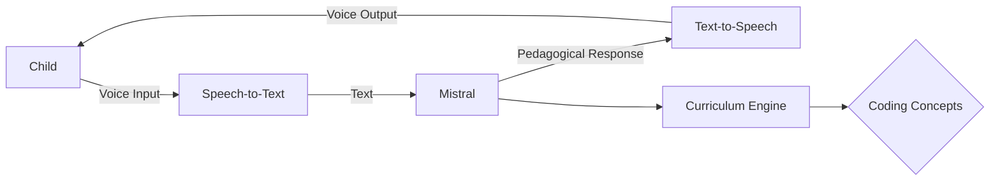

# TutorAgent 🤖🎓

**Voice-First AI Tutor for Elementary Computer Science Education**  
*Empowering young minds to learn coding fundamentals through natural conversation*

---

## 🌟 Vision

TutorAgent reimagines STEM education for the 21st century by combining cutting-edge AI with child-friendly voice interaction. Designed for elementary students (ages 6-12), our solution makes computer science concepts accessible through:

- **Conversational Learning**: Speak naturally with your AI tutor
- **Voice-First Design**: No typing needed - learn through dialogue
- **Playful Discovery**: Gamified coding concepts in everyday language

Powered by Mistral's advanced language models and ElevenLabs' lifelike voice synthesis.

---

## 🚀 Key Features

### Voice-Driven Pedagogy
- **Speech-to-Speech Interface**  
  Natural conversations using ElevenLabs' best-in-class STT/TTS
- **Context-Aware Dialog**  
  Mistral maintains lesson continuity and adapts to learning pace
- **Emotional Intelligence**  
  Voice modulation keeps learners engaged

### Curriculum Aligned
- **Core CS Concepts**  
  Algorithms, logic, sequencing taught through real-world analogies
- **Scaffolded Learning**  
  Progressive difficulty adjusted to age/skill level
- **Instant Feedback**  
  Error correction through supportive voice interactions

### Concept Architecture


### Technical Architecture
```mermaid
graph LR
    Child -->|Voice Input| STT[Speech-to-Text]
    STT -->|Text| Mistral
    Mistral -->|Pedagogical Response| TTS[Text-to-Speech]
    TTS -->|Voice Output| Child
    Mistral --> Curriculum[Curriculum Engine]
    Curriculum --> Concepts{Coding Concepts}

